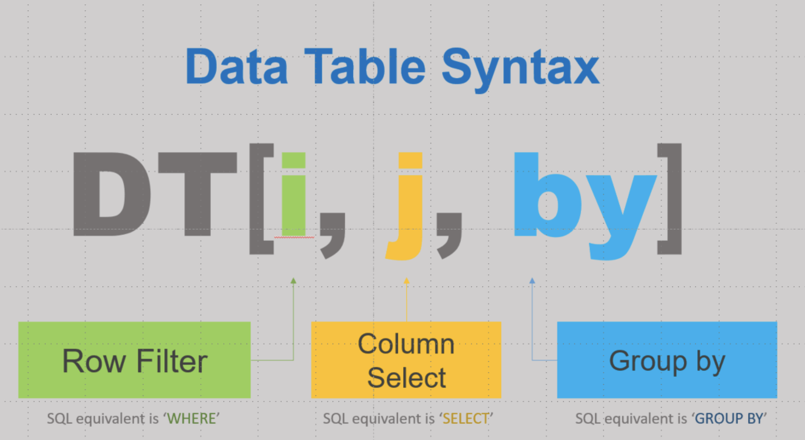

```{r setup, include=FALSE}
knitr::opts_chunk$set(echo = TRUE)
options(datatable.print.nrows = 10)
options(datatable.print.trunc.cols = TRUE)
show.results <- FALSE
```

# Motivation

<div class='float-image-right'>

  
    
</div>

The authors of the **data.table** package are Matt Dowle and Arun Srinivasan. 
There are at least five good reasons to learn the package:

1. Concise syntax
2. Operations are insanely fast and
3. Memory efficient
4. Package is feature rich and
5. Dependency free

Regarding efficiency, it has been shown that **data.table** can be 75x faster than **dplyr**. [Here is a comparison with other systems](https://h2oai.github.io/db-benchmark). We will talk about some of the reasons later in the class. 

It is not the purpose of this class to convince you that data.table is superior to dplyr or vice versa. It is to show you another powerful tool that you can use to tackle big or small data problems efficiently in R. One can use the two packages to complement each other. If you end up liking the dplyr syntax more but want to efficiency advantage, consider using the **dtplyr** package. It uses dplyr syntax while working with data.table objects.

# Creating data.table object

Let's start our session by loading the library. Uncomment the second line and set the working directory where your data for this session is located (don't forget to use forward slashes, e.g. "C:/Users/hana/Documents"):

```{r}
library(data.table)
#setwd("/Users/hana/psrc/rworkshops2020/data.table")
```


To use **data.table** features, we need to create a `data.table` object, which is an enhanced version of `data.frame`. There are several ways to do it:

1. Create it from scratch:
    ```{r}
d <- data.table(x = 1:10, y = letters[1:10])
d
```

2. Convert existing `data.frame`:
    ```{r}
df <- data.frame(x = 1:10, y = letters[1:10])
d <- as.data.table(df)
d
```
    One can do such conversion also on a `tibble` object and thus, it allows to easily switch between **dplyr** and **data.table**. To switch back from **data.table** to **dplyr**, use the `as_tibble()` function.

3. Coercion by reference, i.e. no need to reassign an object:
    ```{r}
dft <- data.frame(x = 1:10, y = letters[1:10])
class(dft)
setDT(dft)
class(dft)
```
    The class of `dft` changed without a re-assignment, thus saving memory. To reverse the operation to make `dft` being `data.frame` again, use the `setDF()` function.

4. **Reading from file (extremely fast!):**
    ```{r}
dt <- fread("ofm_april1_population_final.csv")
class(dt)
```
    For reading from Excel spreadsheets, one can use the `read.xlsx()` function from the **openxlsx** library (as shown in the Rmarkdown class) and then convert to `data.table` via `as.data.table()` as shown above. However, for big datasets the `fread()` function is superior to anything else in R. Reading in the PSRC's parcels dataset (1.3 million rows, 285M) is 13x faster than with `read.csv()`.
    
    The equivalent to `fread()` for writing data into a file is `fwrite()`. It's is also amazingly fast.
    
    Now let's explore the dataset structure.

    ```{r, eval = FALSE}
str(dt)
View(dt)
```

# About data.table syntax

The picture at the top of the page shows the basic syntax of all `data.table`s. While **tidyverse** tends to break up operations step-by-step using verbs for each step, **data.table** aims to do
everything in one concise expression.

# Working with rows: DT[i,]
## Selecting rows

When subsetting by rows, things work similary like in `data.frame`, except the syntax is simpler. As an example, select rows from `dt` that are in King county and are not cities:

```{r, results = show.results}
dt[County == "King" & Filter < 4]
```

Or select all cities that have the word "Wood" in their name:
```{r, results = show.results}
dt[grepl("Wood", Jurisdiction)]
```

Indices work too. Also notice that the comma is optional if no `j` and `by` is used.
```{r, results = show.results}
dt[1:3] # is equivalent to
dt[1:3,]
```

For further processing, we select rows that correspond to cities in the PSRC's four counties:

```{r}
dt4c <- dt[Filter == 4 & County %chin% c("King", "Kitsap", "Pierce", "Snohomish")] 
dim(dt4c)
```
The `%chin%` operator is like `%in%` but optimized for speed and is for character vectors only. 


## Ordering rows

The `i` dimension is also used for putting rows into specific order. Here, ordering by Jurisdiction:

```{r}
dt4c[order(Jurisdiction)]
```


Ordering by reference (in place) implements optimized ordering:
```{r}
setorder(dt4c, County, Jurisdiction)
```

# What does "by reference" mean?

Base R assigns objects **by value**, i.e. when an object is assigned, a copy of the original object is created, i.e. the value occupies a different address in the memory. Python, C, Java and other programming languages work this way.

Assignment **by reference** (or "in place") differs as it does not create a separate copy; it rather references the original object, i.e. it points to the same address in the memory. In addition to **data.table**, C++ or Python pandas support this as well. It is well suited for working with big data as it is more memory efficient, but one has to be careful not to overwrite the original object. 

```{r,  fig.cap = " ", fig.align='center', fig.show='hold', out.width="49%", echo=FALSE, eval = TRUE}
knitr::include_graphics(c( '../images/byvalue.png', '../images/byreference2.png'))
```

# Working with columns: DT[,j]

## Renaming columns

The column names of our dataset are not very pretty, so let's change it. 
```{r}
colnames(dt4c)
```
There are at least two ways to rename columns:

1. By reference: (we replace Jurisdiction by City)
    ```{r}
setnames(dt4c, "Jurisdiction", "City")
```
    Note that both, the second and third arguments can include more than one name, if renaming of multiple columns is desired.
2. Using `colnames()` as with `data.frame`: (we extract the first four characters from the time columns)
    ```{r}
colnames(dt4c)[5:ncol(dt4c)] <- substr(colnames(dt4c)[5:ncol(dt4c)], 1, 4)
colnames(dt4c)
```

## Selecting columns

Columns can be selected in various ways. The most common case is probably a selection by column names:

```{r}
dt4c[, .(County, City)]
```

Selection by an index still works:

```{r}
dt4c[1:10, 1:5]
```

Names can also be used in the same way as indices. Use backquotes if the column name starts with a number:
```{r}
dt4c[1:5, Filter:City]
dt4c[1:5, Filter:`2014`]
```

The `.()` is a synonym for `list()`:
```{r}
dt4c[1:5, list(County, City)]
```

Or use the same way as in `data.frame`, using the `c()` function:
```{r}
dt4c[1:5, c("County", "City")]
```
However, if you assign column names to an object, say `cols`, then `dt4c[, cols]` will not work. Instead use 
```{r, results = show.results}
cols <- c("County", "City")
dt4c[, ..cols] # or
dt4c[, cols, with = FALSE]
```

Negation can be used to exclude columns. Here, select all columns except the ones given:
```{r}
dt4c <- dt4c[, !c("Line", "Filter")]
dim(dt4c)
```

## Assigning values to columns

### The `:=` operator
Assignments to columns is done via `:=` which assigns by reference:
```{r, results = show.results}
dt4c[, id := 1:nrow(dt4c)]
dt4c[, id := id + 5000]
```

Be aware of the implications of assigning by reference. Here is an example:
```{r}
d                 # d is our toy data.table
a <- d            # assign d to a
a[ , x := NULL][] # delete column in a
d                 # d changed as well!
```

Here is the right way to do it using the `copy()` function:
```{r}
d <- data.table(x = 1:10, y = letters[1:10]) # re-create d
a <- copy(d)      # use the copy() function to create a separate object
a[ , x := NULL][] # delete column in a
d                 # d is not impacted
```

Note that in the above example I used `[]` at the end of lines to print out the values of the object. They are not needed tfor the actual assignment.

### Partial assignment

You do not have to assign values to all rows - a partial assignment can be done with the help of the `i` dimension. Say we want to increase the `id` column by 1000 but only for King county:

```{r}
dt4c[County == "King", id := id + 1000]
dt4c[1:4, .(County, City, id)]
dt4c[50:53, .(County, City, id)]
```

If the column does not exist, a partial assignment fills in `NA`s:
```{r}
d[x < 5, z := TRUE][]
```

Let's now delete the `id` column:
```{r}
dt4c[, id := NULL]
```


### Multiple things at once

One can **assign multiple columns** in one command. Here we add two columns (`u` and `v`) and delete one column (`z`) in one go:

```{r}
d[ , ':='(u = x^2, v = x^3, z = NULL)]
```

We can also **chain multiple operations** into one line. Here we first add a column `w`, then we add a column `dummy` via a partial assignment, then we order the rows: 
```{r}
d[, w := -4:5][w > 0, dummy := TRUE][order(x, decreasing = TRUE)]
```
Note that the first two operations are by reference, i.e. the `d` object is changed. The last operation does not change the object, unless we would re-assign it to `d`.

To assign multiple categories to one variable, there is a new function called `fcase()` which is inspired by `CASE WHEN` in SQL, and it is optimized for speed. For example.

```{r}
d[, category := fcase(w > 0, "positive", 
                      w %between% c(-2, 0), "slightly negative",
                      w < -2, "negative")]
```
Similarly to `%chin%`, the `%between%` operator is **data.table** specific.

Finally, an assignment can be also used to rename columns:
```{r}
d[, dummy_new := dummy][, dummy := NULL][]
```
This way of renaming columns changes the order of the columns. You can use the function `setcolorder()` to reorder columns in place.

## Subsetting with .SD

`.SD` (**S**ubsetting **D**ata) is a very powerful operator in **data.table**. It allows to perform a given function on any subset of columns. 

To demonstrate it, as part of our cleaning of `dt4c` we will convert all time-related columns into the numeric type. We could do it column by column as

```{r}
dt4c[, `2010` := as.numeric(`2010`)]
```

That would be a little tedious to do it for many columns. Thus, we use the `.SD` symbol to apply the `as.numeric` function to the 2010-2019 columns at once: 
```{r}
cols <- as.character(2010:2019) # column names to apply the conversion to
dt4c[, (cols) := lapply(.SD, as.numeric), .SDcols = cols] 
str(dt4c)
```
The `lapply()` function is a standard base R function that applies the given function (here `as.numeric`) to a list or a dataset (given by the first argument), element by element, or columnn by column. In the **data.table** context, the `.SD` symbol is replaced by a dataset composed by the columns given by `.SDcols`. Thus, the function `as.numeric` is applied to all columns defined in the `cols` object, and the result is then assigned to columns given by left side of `:=`, which here have the same names.

The `.SD` symbol is often used in aggreagations, and we will see an example of it in the next section.

# Group by: DT[,,by]

## Simple aggregations

The most simple aggregations are done by applying an aggregating functions to columns. For example,

```{r}
dt4c[, sum(`2019`)]
dt4c[, mean(`2019`)]
```

For counts use the special symbol `.N`:

```{r}
dt4c[, .N]
```

## Group by

Things get more interesting when we aggregate by groups. Here summing by a column, by a conditional expression and by multiple expressions. If you want to name the aggregated column, use `.()` on the `j` dimension:
```{r}
dt4c[, sum(`2019`), by = County]
dt4c[, .(Population = sum(`2019`)), by = County]
dt4c[, .(Population = sum(`2019`)), by = `2019` > 100000]
dt4c[, .(Population = sum(`2019`), Count = .N), by = `2019` > 100000]
dt4c[, .(Population = sum(`2019`), Count = .N), by = .(County, `2019` > 100000)]
```

The above commands do not change the `dt4c` dataset. To add an aggregated column to the dataset, use the `:=` symbol:

```{r}
dt4c[, county_sum := sum(`2019`), by = County]
```

Now one can use the aggregated column to compute county shares. If it was done correctly, the sum of shares by county should yield 1.
```{r}
dt4c[, county_share := round(`2019`/county_sum*100, 2)]
dt4c[, sum(county_share), by = County] 
```

## Using `.SD`

The power of the `.SD` feature shows especially in aggregations. It allows to easily aggregate for multiple columns. Here we sum all columns from 2010 to 2019 (alternatively, we could use our object `cols` created earlier):

```{r}
dt4c[, lapply(.SD, sum), by = County, .SDcols = `2010`:`2019`]
```

# Joining datasets

To demonstrate how to join datasets, let's read in the dataset of counties provided with the class:
```{r}
counties <- fread("counties.csv")
```

We now merge this dataset with our `dt4c`. The joining columns are `County` for `dt4c` and `county_name` for dataset `counties`. There are two ways of doing the join. 

## The merge function

The first one is using the `merge()` function:

```{r}
dt4cm <- merge(dt4c, counties, by.x = "County", by.y = "county_name")
```
Note that if the joining columns would be the same, just use the argument `by`.

## Join via the `i` dimension and setting keys

The second way of doing the join is using the first (`i`) dimension. For this example we first create another  county dataset by aggregating `dt4c` and renaming the `County` column to be `county_name`, chaining the operations one after another: 

```{r}
popcty <- dt4c[ , .(Pop = sum(`2019`)), by = County][, county_name := County][, County := NULL]
```

The left and right joins can be done via
```{r}
popcty[counties, , on = .(county_name)] # left join
counties[popcty, , on = .(county_name)] # right join
```

Setting a key can significantly decrease the runtime. For example, merging the PSRC's parcels with the buildings dataset was 16x faster than when merging using base R.

```{r}
setkey(popcty, "county_name")
setkey(counties, "county_name")
```

When a key is set, the `on` argument can be omitted:
```{r}
counties[popcty]
```

To explicitely use columns from the left dataset, use the prefix `i.`. Below, the `Pop` column is from the dataset `popcty`, therefore it is used as `i.Pop`, while the column `acres` is from `counties` and therefore does not have any prefix.
```{r}
counties[popcty, .(county_name, density = i.Pop/acres)]
```

We now add the density column to the `counties` dataset:
```{r}
counties[popcty, density := i.Pop/acres][]
```

Notice that by default we are doing an outer join:
```{r}
popcty[county_name != "King"][counties]
```
To do an inner join, use
```{r}
popcty[county_name != "King"][counties, nomatch = NULL]
```
One can also do a join that would give records not in common:
```{r}
counties[!popcty[county_name != "King"]] 
```


# Reshaping data

The format of the data we've been working so far is often called *wide*. It is a typical data format of demographic datasets.
```{r}
head(dt4c)
```

Let's remove columns that we will not need anymore.
```{r, results = show.results}
dt4c[, ':='(county_sum = NULL, county_share = NULL)]
```

## Wide to long
Various packages, including **ggplot2** require the data to be in the so called *long* format (or *tidy*) where each value (here population) is its own record, i.e. each value occupies one row. To convert from wide to long, use the `melt()` function. In our example, we need to specify that `County` and `City` are non-population columns:

```{r}
dtl <- melt(dt4c, id.vars = c("County", "City"))
head(dtl)
```

To name the variable and value  columns explicitely, use the following arguments:

```{r}
dtl <- melt(dt4c, id.vars = c("County", "City"), variable.name = "Year", value.name = "Population")
head(dtl)
```

Now this dataset can be plugged directly into `ggplot`:
```{r}
library(ggplot2)
g <- ggplot(dtl[County == "Pierce"]) + 
      geom_col(aes(x = City, y = Population, fill = as.factor(Year)),
               position = "dodge") + coord_flip() + labs(fill = "Year")
print(g)
```

## Long to wide
If you have a dataset in the long format and need to convert it to the wide format, for example for reporting purposes, use the `dcast()` function. Its second argument is a formula (`LHS ~ RHS`) that determines which columns stay (RHS) and which columns are cast (LHS). `...` represents all remaining variables:

```{r}
dtw <- dcast(dtl, County + City ~ Year, value.var = "Population")
dtw <- dcast(dtl, ... ~ Year, value.var = "Population")
head(dtw)
```

# Export dataset
As mentioned previously, the counterpart of the reading function `fread()` is the function `fwrite()`. It is the most efficient way to export data. Let's write out our `dtw` dataset:

```{r eval = FALSE}
fwrite(dtw, "my_ofm.csv")
```

See `?fwrite` for more options.
