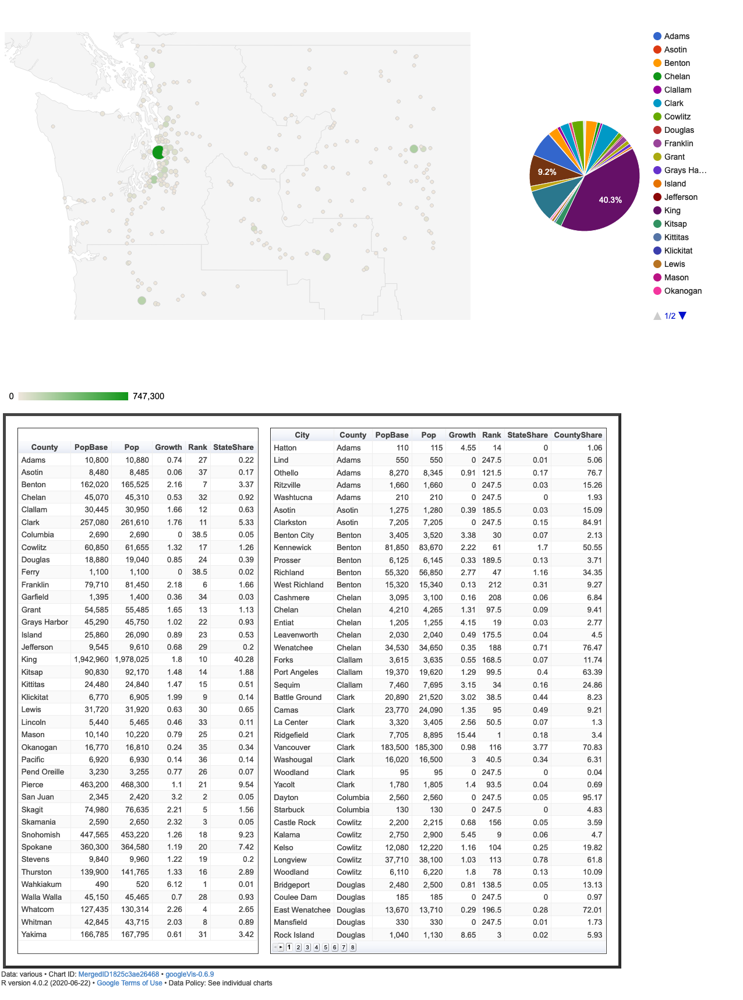

```{r setup, include=FALSE}
knitr::opts_chunk$set(echo = TRUE)
```

We will create tables of growth rates for counties and cities of the WA state, plot all WA cities on a map and create a page with a map, pie chart and tables using the [Google Visualization API](https://developers.google.com/chart/interactive/docs/gallery). To get there, please install the **googleVis** package and then follow the steps below:

1. Re-create the `dt` object from the class by reading in the OFM data. It contains population for all cities in WA.

    ```{r eval = FALSE}
dt <- fread("ofm_april1_population_final.csv")
```

2. Extract all valid city records (i.e. where Filter is 4) and 3 columns, namely Jurisdiction and the two columns containing the 2018 and 2019 population. Store the object in `citypop`. Rename the 2018 column to "PopBase" and the 2019 column to "Pop".

3. Convert the PopBase and Pop columns into numeric type.

4. Create a dataset `countypop` containing the sums of the PopBase and Pop columns by County. The aggregated columns should have the same names, namely PopBase and Pop.

5. In `citypop`, create a column Growth as (Pop - PopBase)/PopBase * 100 rounded to 2 decimals. Do the same for `countypop`.

5. In `citypop`, add two columns in one go (using the `':='()` syntax):
    i. Column Rank that ranks cities by Growth in decreasing order. Hint: Use the `frank()` function. Ranking in decreasing order can be achieved by passing negative values of the original column, here `Growth`. 
    ii. Column StateShare computed as the share of Pop within the state (as percentage).
    
6. Do the same for `countypop`.

7. In `citypop`, add a column CountyShare computed as the share of Pop within its county (as percentage). Hint: For this you can join `citypop` and `countypop` using the `i` syntax. It should have the form (fill in `...`)
    ```{r eval = FALSE}
citypop[countypop, CountyShare := ..., on = ...]
```

8. In `citypop`, create a column City which takes values of Jurisdiction but removes any text containing " (part)". Hint: For replacing text use the function `gsub(" (part)", "", Jurisdiction, fixed = TRUE)` on the `j` dimension (just assign that call to City). Remove the Jurisdiction column by chaining the removal right after the replacement. 

9. To move the City and County columns to the front of the dataset, use 
    ```{r eval = FALSE}
setcolorder(citypop, c("City", "County"))
```

10. Create interactive (sortable) tables for cities and counties by 

    ```{r eval = FALSE}
library(googleVis)
gtbl.county <- gvisTable(countypop)
plot(gtbl.county)
gtbl.city <- gvisTable(citypop, options = list(page='enable', pageSize = 40))
plot(gtbl.city)
```
    (Note that to view the tables there needs to be an internet access.)

11. The file "citycenters.csv" provided with the class data contains the latitude and longitude of cities in WA, which we will need for the map. Read the file into R using `fread` and store it in an object called `cc`.

12. Rename the column "NAME" in the `cc` dataset to "City".

13. Join the datasets `citypop` and `cc` on the "City" column, so that columns "lat" and "long" appear as a new character column (called "latlong") of `citypop` in the form lat:long. Hint: Use the `paste` function to combine "lat" and "long" with `sep=":"`. In the joining command, don't forget to use the prefix `i.` for those two columns. 

14. Can you extract records where there was no match? Hint: the "latlong" column is NA for those records. Remove those records from `citypop`.

15. Now we neeed to create a column with the info that will be displayed when clicking on the city icons. Say we want to see the city name, population and growth. Thus, create a column "Tip" constructed via `paste0(City, ": ", Pop, ", Gr: ", Growth)`.

16. Plot points on a google map using:
    ```{r eval = FALSE}
plot(gvisMap(mypop, "latlong", "City", tipvar = "Tip", 
             options = list(height = 800, width = 800)))
```

17. Another types of google charts are a Geo Chart and a Pie Chart. To combine such charts with the tables created previously on one page, use the following code:
    ```{r eval = FALSE}
gchart <- gvisGeoChart(mypop, "latlong", hovervar = "Tip", colorvar = "Pop", 
            options = list(region="US-WA", resolution = "metros", 
                           height = 800, width = 800))
gpiechart <- gvisPieChart(countypop[, .(County, StateShare)], 
                          options = list(width=500, height=800))

plot(gvisMerge(
        gvisMerge(gchart, gpiechart, horizontal = TRUE),
        gvisMerge(gtbl.county, gtbl.city, horizontal = TRUE, 
                        tableOptions = "cellspacing=\"20\" border=\"5\"")
        )
     )
```

**That's it! Did you produce a page like this?**

